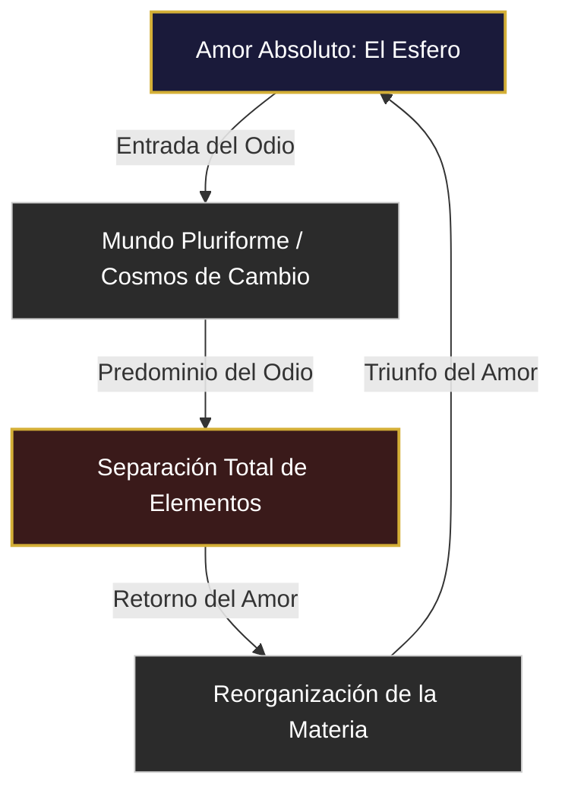

> «Un doble relato voy a contarte: unas veces crecen hasta ser una sola a partir de muchas; otras se dividen para ser muchas a partir de una sola. Doble es la generación de los seres mortales, doble su desaparición. Pues a la una la reúne y la destruye el concurso de todas las cosas, y la otra, tras haberse alimentado a su vez al dividirse ellas, se dispersa y desvanece. Y estas cosas nunca cesan en su continuo alternar: unas veces por Amor reuniéndose todas en uno, y otras, en cambio, separándose cada una por la hostilidad del Odio.»
> — Empédocles, Fragmento DK 31 B 17 (Simplicio, *In Phys.* 157, 25). Recogido en *Los filósofos presocráticos. Vol. II* (<a href="https://amzn.to/43Xqskm" target="_blank" rel="noopener noreferrer" style="color: #C4973A; text-decoration: none; font-weight: 600;">[Edición Gredos]</a>).

---

## Génesis y Conexión Histórica

Empédocles de Agrigento (c. 495–435 a.C.) se sitúa en la encrucijada intelectual inmediata a la revolución de Elea. Su planteamiento es incomprensible sin la lección anterior: la ontología radical de **Parménides** (FIL-01-H), que había decretado la absoluta inmovilidad del Ser y proscrito el no-ser, clausurando con ello toda justificación racional para el movimiento, la multiplicidad y el cambio.

Para superar este bloqueo epistémico, Empédocles toma como punto de partida:

*   **La herencia eleática:** Acepta que el ser absoluto no puede originarse de la nada ni disolverse en ella; lo real debe ser eterno e inmutable en su nivel constitutivo.
*   **La exigencia empírica:** Rechaza la conclusión parmenídea de que el mundo sensible es una mera ilusión (*doxa*); la pluralidad y el cambio son hechos fenoménicos que exigen una explicación racional.
*   **La síntesis presocrática:** Combina las sustancias primigenias propuestas por los jonios (agua, aire, fuego) y añade la tierra, articulando una respuesta pluralista que sustituye el monismo originario por un modelo composicional dinámico.

---

## 1. La ruptura del monismo y la encrucijada eleática

La ontología de Parménides de Elea impuso un callejón sin salida especulativo a la incipiente *physiologia* (φυσιολογία) de los pensadores jonios. Al decretar que el ser es uno, indivisible, intemporal e inmóvil (*monon* [μόνον], *ateleston* [ἀτελεστον], *atremes* [ἀτρεμές]), la vía de la verdad (*alētheia* [ἀλήθεια]) clausuró toda posibilidad lógica para el cambio, la alteración cualitativa y la destrucción del cosmos. Admitir la transformación de una sustancia primigenia (*archē* [ἀρχή]) implicaba aceptar el paso del ser al no-ser o viceversa, un abismo lógico insalvable bajo la premisa eleática de que el no-ser es impensable e inexpresable. 

Frente a esta parálisis racional, los físicos posteriores —denominados pluralistas— se vieron obligados a salvar los fenómenos (*sōzein ta phainomena* [σῴζειν τὰ φαινόμενα]) sin vulnerar los principios lógicos fundamentales establecidos por Parménides. Empédocles de Agrigento asume este desafío a través de una audaz síntesis ontológica: no niega los atributos de eternidad e inmutabilidad que los eleatas exigían para el ser, sino que los multiplica. El devenir del mundo sensible, caracterizado por la pluralidad y el cambio, no es una ilusión de los sentidos (*doxa* [δόξα]), sino el resultado de la mezcla (*mixis* [μῖξις]) y separación (*diallaxis* [διάλλαξις]) de entidades originarias que, en sí mismas, permanecen inalterables. La aparente destrucción y nacimiento no son transiciones ontológicas entre el ser y la nada, sino configuraciones geométricas y cuantitativas de lo que siempre es.

---

## 2. Las cuatro raíces (*rhizōmata* [ῥιζώματα]): De la deificación a la física elemental

Para superar el monismo jónico —que postulaba un único principio material mutable— Empédocles establece que la realidad física se cimenta sobre cuatro elementos irreducibles e imperecederos a los que denomina "raíces" (*tetrastoicheia* [τετραστοιχεῖα] o *rhizōmata* [ῥιζώματα]): fuego, aire, tierra y agua. En el fragmento DK 31 B 6, el filósofo de Agrigento introduce estas raíces mediante nombres de divinidades del panteón mítico, acentuando su carácter eterno y divino:

> «Escucha primero las cuatro raíces de todas las cosas: Zeus resplandeciente, Hera dadora de vida, Aidoneo y Néstis, que con sus lágrimas empapa el manantial de los mortales.»
> — Empédocles, DK 31 B 6 (Aecio, I, 3, 20).

La exégesis filológica clásica asocia estas divinidades con los siguientes ámbitos:

*   **Zeus:** La naturaleza ígnea y luminosa (*pyr* [πῦρ]).
*   **Hera:** El aire vital y respirable (*aēr* [ἀήρ]).
*   **Aidoneo (Hades):** La solidez y estabilidad terrestre (*gaia* [γαῖα]).
*   **Néstis:** La humedad seminal e hídrica (*hydōr* [ὕδωρ]).

Estas raíces poseen los atributos formales del ser de Parménides: son increadas (*agenēta* [ἀγένητα]), indestructibles (*anōlethra* [ἀνώλεθρα]), cualitativamente homogéneas e idénticas a sí mismas en el tiempo. Ninguna de las raíces es anterior ni superior a las demás; coexisten en un plano de igualdad ontológica (*isotimoi* [ἰσότιμοι]). 

La novedad metodológica de Empédocles radica en que el cambio en la *physis* (φύσις) ya no se concibe como una alteración cualitativa interna de la materia (como la rarefacción y condensación de Anaxímenes), sino como una combinación mecánica exterior. La diversidad del cosmos surge de la proporción (*logos tēs mixeōs* [λόγος τῆς μίξεως]) con la que estas cuatro raíces se entrelazan. Aristóteles en su tratado *De Generatione et Corruptione* señala que este modelo representa el primer intento sistemático de clasificar cualitativamente los componentes materiales del universo, anticipando el concepto moderno de elemento químico.

  <a href="https://amzn.to/43Xqskm" target="_blank" rel="noopener sponsored" style="display: inline-flex; align-items: center; justify-content: center; gap: 0.5rem; background: #C4973A; color: #06060E; font-family: 'Helvetica Neue', Arial, sans-serif; font-size: 0.95rem; font-weight: 700; padding: 0.8rem 1.8rem; border-radius: 9999px; text-decoration: none; box-shadow: 0 4px 15px rgba(196,151,58,0.3); transition: all 0.2s ease-in-out; margin: 0 auto;">
    <svg style="width: 20px; height: 20px; fill: currentColor;" viewBox="0 0 24 24" xmlns="http://www.w3.org/2000/svg">
      <path d="M15.3,12.2c0,1.6-0.9,2.8-2.6,2.8c-1.3,0-2.3-0.8-2.3-2.4c0-2.1,1.9-2.6,4.9-2.6v0.2C15.3,10.9,15.3,11.6,15.3,12.2z M17.6,16.5c-0.2,0.3-0.5,0.4-0.8,0.2c-0.6-0.4-1.2-0.8-1.7-1.1c-1.1,0.9-2.6,1.4-4.2,1.4c-3.1,0-5.3-2.1-5.3-5.2c0-3.9,3.5-5.3,7.9-5.3c0.9,0,1.7,0.1,2.4,0.2V6.2c0-1.4-0.6-2.4-2.4-2.4c-1.2,0-2.5,0.5-3.3,1C7.2,5,7,5,6.8,4.7L6,3.6C5.8,3.3,5.9,3.1,6.2,2.9C7.4,2,9.3,1.4,11.7,1.4c3.9,0,5.9,2.1,5.9,6v6.2c0,1.1,0.4,1.6,0.8,2.1c0.2,0.2,0.2,0.6-0.1,0.8L17.6,16.5z M22.2,20.1c-2.3,1.7-5.6,2.5-8.8,2.5c-4.4,0-8.4-1.5-11.4-4.1C1.8,18.3,2,18,2.3,18.1c3.2,1,6.9,1.5,10.6,1.5c3,0,6.1-0.4,8.8-1.3c0.4-0.1,0.8,0.2,0.6,0.6C22.2,19.3,22.2,19.7,22.2,20.1z M22.8,22c-0.1,0.2-0.3,0.2-0.5,0.1c-0.6-0.3-1.5-0.7-2.3-0.8c-0.2-0.1-0.3-0.3-0.1-0.5c0.2-0.2,0.7-0.7,0.9-0.9c0.1-0.1,0.3-0.1,0.4,0.1c0.5,0.8,1.4,1.8,1.7,2C23,22.1,22.9,22,22.8,22z"/>
    </svg>
    Comprar Presocráticos II (Gredos) en Amazon
  </a>

---

## 3. Las fuerzas motoras extrínsecas: *Philia* (Φιλία) y *Neikos* (Νεῖκος)

Dado que las cuatro raíces materiales son intrínsecamente inertes y carecen de la capacidad de auto-movimiento (a diferencia del hilozoísmo de los pensadores de Mileto, donde la materia poseía alma y vida propia), Empédocles introduce dos principios motores de carácter extrínseco que operan sobre ellas: el Amor (*Philia* [Φιλία], *Storgē* [Στοργή]) y el Odio o Discordia (*Neikos* [Νεῖκος]).

Estas dos potencias antagónicas no representan meros sentimientos antropomórficos, sino fuerzas físicas universales que rigen la dinámica de los agregados materiales:

*   **El Amor (*Philia* [Φιλία]):** Actúa como una fuerza centrípeta y de atracción. Tiende a unificar las raíces heterogéneas, mezclándolas hasta diluir las diferencias individuales en un todo armónico.
*   **El Odio (*Neikos* [Νεῖκος]):** Funciona como una fuerza centrífuga y de repulsión. Su acción fragmenta la mezcla de elementos heterogéneos y busca agrupar a las partes semejantes con sus semejantes, separando los elementos distintos.

Al independizar la causa material (las cuatro raíces) de la causa eficiente u origen del movimiento (el Amor y el Odio), Empédocles prefigura la posterior división aristotélica de las causas. La tensión perpetua entre estas dos fuerzas genera un ciclo dinámico que determina la evolución del universo.

Este ciclo cósmico oscila perpetuamente a través de cuatro estadios:
1.  **El Esfero (*Sphairos* [Σφαῖρος]):** Es el imperio absoluto del Amor. Las cuatro raíces se hallan tan íntimamente mezcladas y disueltas que forman una esfera perfecta, inmóvil y homogénea, carente de formas singulares o seres particulares. Es una unidad divina semejante al Ser indivisible de Parménides.
2.  **La irrupción del Odio:** El Odio penetra desde la periferia hacia el centro del Esfero, iniciando la segregación de los elementos. Es en este periodo de transición y conflicto donde el ordenamiento del cosmos se hace posible; las fuerzas combinadas del Amor y el Odio permiten el surgimiento de la vida orgánica, los astros y la geografía terrestre.
3.  **El triunfo del Odio:** Los elementos se separan por completo, agrupándose de manera estricta y homogénea (tierra con tierra, fuego con fuego, etc.). En este punto, al no existir mezcla ni atracción entre elementos diferentes, el cosmos ordenado colapsa en la esterilidad.
4.  **El retorno del Amor:** La fuerza atractiva vuelve a introducirse en las esferas de elementos aislados, forzando nuevamente su mezcla. Este segundo periodo de transición engendra otro ciclo de cosmos sensible hasta que los elementos son asimilados por completo en la homogeneidad divina del Esfero.

---

## 4. Epistemología y fisiología del *Logos* (Λόγος) de la Mezcla

La teoría del conocimiento de Empédocles se deriva directamente de sus presupuestos cosmológicos y se resume en el principio de que "lo semejante se conoce por lo semejante". En el fragmento DK 31 B 109, el agrigentino declara:

> «Con la tierra vemos la tierra, con el agua el agua, con el aire el aire brillante, y con el fuego el fuego destructor; con el amor vemos el amor y con el odio el triste odio.»
> — Empédocles, DK 31 B 109 (Aristóteles, *De Anima* 404b13).

La captación empírica se explica a través de mecanismos puramente físicos:

*   **Las emanaciones (*aporrhoai* [ἀπορροαί]):** Los objetos del mundo exterior desprenden continuamente efluvios de su propia materia que viajan por el espacio.
*   **Los poros (*poroi* [πόροι]):** El cuerpo humano dispone de conductos sensoriales específicos. La percepción se produce únicamente cuando los poros son del tamaño geométrico exacto para recibir las emanaciones de un elemento correspondiente.
*   **El logos de la mezcla (*logos tēs mixeōs*):** Define no solo la percepción sensible, sino las propiedades Py físicas de los tejidos biológicos. La sangre representa la mezcla más perfecta y equitativa de las cuatro raíces, razón por la cual es considerada el asiento de la inteligencia y el pensamiento reflexivo.

---

## 5. Del ciclo cósmico a la física de sistemas complejos

La física de Empédocles, lejos de ser una especulación puramente poética, ofrece un marco analógico precursor de principios termodinámicos modernos y del modelo estándar de partículas:

*   **Interacciones atómicas:** La tensión entre *Philia* y *Neikos* evoca la interacción entre las fuerzas de atracción y repulsión en los núcleos atómicos. La fuerza nuclear fuerte opera como una manifestación del Amor empedocleano, venciendo la repulsión electrostática (el Odio) de los protones para mantener unida la materia. 
*   **Termodinámica de no-equilibrio:** El ciclo que transita entre el *Sphairos* y la separación de las raíces resuena con los postulados termodinámicos. La segunda ley de la termodinámica establece que todo sistema cerrado evoluciona inexorablemente hacia la máxima entropía —el estado de muerte térmica o desorden molecular, análogo al triunfo definitivo del Odio—.
*   **Estructuras disipativas:** La aparición de vida y orden complejo (las estructuras conceptualizadas por Ilya Prigogine) solo ocurre en el umbral de desequilibrio dinámico donde ambas tendencias colisionan. La existencia humana y la biodiversidad no surgen en la paz del Esfero ni en el aislamiento del Odio puro, sino en la fluctuación intermedia del conflicto cósmico.

---

## Semillas y Ecos para el Futuro

La cosmología dinámica de Empédocles plantó las bases para el desarrollo conceptual de las siguientes corrientes y autores de la posteridad:

*   **La física hilemórfica de Aristóteles:** Quien sistematizará el concepto de los cuatro elementos, dotándolos de cualidades contrarias (caliente/frío, seco/húmedo), armadura explicativa que dominará la ciencia natural hasta la revolución científica del siglo XVII.
*   **La medicina humoral galénica:** La noción de que la salud y el carácter dependen de la proporción exacta de las raíces inspirará directamente la teoría médica de los cuatro humores corporales (sangre, flema, bilis amarilla y bilis negra).
*   **El atomismo de Leucipo y Demócrito (FIL-01-K):** La disociación empedocleana entre la materia pasiva (raíces) y las fuerzas eficientes (Amor/Odio) iniciará el camino hacia la física mecánica, que prescindirá de la intención teleológica en favor de las colisiones necesarias en el vacío.

---

<section class="bibliography">

### Referencias Académicas

*   Copleston, F. (2011). *Historia de la Filosofía. Tomo I: Grecia y Roma*. Barcelona: Ariel. <a href="https://amzn.to/4gQHI26" target="_blank" rel="noopener noreferrer" style="color: #C4973A; text-decoration: none; font-weight: 600; margin-left: 0.5rem;">[Ver en Amazon]</a>
*   Empédocles. (1985). *Fragmentos*. En Kirk, G. S., Raven, J. E., & Schofield, M., *Los filósofos presocráticos. Vol. II*. Madrid: Editorial Gredos. <a href="https://amzn.to/43Xqskm" target="_blank" rel="noopener noreferrer" style="color: #C4973A; text-decoration: none; font-weight: 600; margin-left: 0.5rem;">[Ver en Amazon]</a>
*   Guthrie, W. K. C. (2010). *Historia de la Filosofía Griega. Tomo II: La tradición presocrática desde Parménides a Demócrito*. Madrid: Editorial Gredos. <a href="https://amzn.to/3SALdjl" target="_blank" rel="noopener noreferrer" style="color: #C4973A; text-decoration: none; font-weight: 600; margin-left: 0.5rem;">[Ver en Amazon]</a>
*   Prigogine, I., & Stengers, I. (1997). *La nueva alianza: Metamorfosis de la ciencia*. Madrid: Alianza Editorial.

</section>