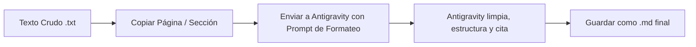

# Protocolo de Revisión y Edición con Antigravity

Este protocolo establece el flujo de trabajo para transformar texto crudo extraído de PDFs en capítulos académicos perfectamente formateados en Markdown con citación verificada.

---

## 📋 Flujo de Trabajo



---

## ✉️ Estructura del Mensaje para Antigravity

Para asegurar la mayor precisión ("a prueba de fallas"), cuando envíes un texto extraído a Antigravity, utiliza la siguiente plantilla de mensaje:

```text
Procesa la siguiente página utilizando el protocolo de revisión Nihil Novi.

Detalles de la Obra:
- Autor: [Ej. Aristóteles]
- Obra: [Ej. Metafísica]
- Estilo de Citación Requerido: [Ej. Bekker / Stephanus / APA 7 / Akademie]
- Notas del Traductor: [Cualquier aclaración sobre términos clave]

Texto Crudo:
=========================================
[Pega aquí el texto extraído del archivo .txt]
=========================================
```

---

## 🛠️ Reglas que Aplicará Antigravity

Cuando reciba este mensaje, Antigravity realizará de forma automática y precisa las siguientes operaciones:

1.  **Limpieza de OCR:** Corrección de caracteres corrompidos, tildes faltantes, unión de palabras rotas por salto de línea y eliminación de ruido (cabeceras, pies de página o números de página física).
2.  **Detección y Anotación de Citas Clásicas:**
    *   Si el texto contiene números de referencia especiales (ej. `980a` para Aristóteles o `473` para Platón), se mantendrán en el texto en formato inline o como marcas marginales visibles (ej. `*Met.* 980a21`).
    *   Si es una cita directa, se estructurará con sangrado y formato de cita de bloque en Markdown (`> blockquote`).
3.  **Marcadores de Glosario / Conceptos Clave:** Las palabras técnicas clave en su idioma original (griego, alemán, latín) se colocarán en cursiva con su traducción sugerida al español entre corchetes (ej. *Sein* [ser]).
4.  **Generación de Notas al Pie:** Si el texto extraído contiene notas numeradas en el cuerpo (ej. `[1]` o `¹`), Antigravity las colocará al final del fragmento usando la sintaxis de Markdown `[^1]: Contenido de la nota`.
5.  **Entrega Limpia:** El resultado se devolverá como un bloque de Markdown formateado listo para ser copiado directamente al archivo `.md` final.
